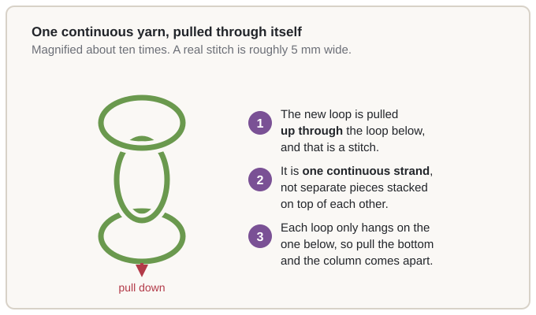

# 01.1 · What knitting is: loops pulled through loops

Every piece of knitting you have ever seen — a jumper, a hat, a pair of socks — was made by one
action, repeated: a loop of yarn pulled through another loop of the same yarn. This lesson is about
that action and what follows from it. You knit nothing today, and you need to buy nothing to read
it. Ten minutes here makes the rest of the module easier, because every lesson in it does something
to those loops.

## What you need

Nothing. There is no yarn and no needle in this lesson, and nothing to finish at the end of it.

Later in this module you will want one 5 mm (US 8) circular needle, one ball of smooth
light-coloured worsted-weight wool, scissors, a tapestry needle and a tape measure;
[the Module 1 printable pack](../../labs/module-01/) holds the full kit list and a blank swatch
card, and none of it is needed yet. Put a knitted jumper, hat or scarf within reach if you own one.

## Why it works

Take a knitted jumper, turn it inside out, and look. You see rows of small V shapes in vertical
columns, and every V is one piece of yarn bent into a loop. Follow that yarn: it does not stop at
the end of a V. It goes up out of one loop, across into the next, and on to the row above, without a
break, for as long as the garment is tall. So the fabric is not stacked pieces and not a grid of
squares. It is **one continuous yarn pulled through itself in a series of loops**, and these four
consequences are what you will use again and again.

### 1. It is one strand, so there is no seam and nothing to cut off

No two pieces were ever joined to make the fabric. The bottom edge is not a separate hem: it is the
first row of loops, made by the cast-on, in the same yarn as everything above it, and the top edge
is the last row, held shut by a bind-off. So a knitted hat has no side seam, and nothing is ever cut
off the bottom of a knitted piece: there is no surplus down there to remove. A short tail is left,
and woven in at the end like any other end.

### 2. Each loop only hangs on the loop below it

A loop does not grip its neighbours to the left or the right. It sits inside exactly one other
loop, the one below it, and that is its only anchor — so the connection between the bottom of the
fabric and the top runs up through every stitch, with no gaps in it. Pull the fabric down from the
top and every loop in a column takes part of that pull, instead of a few knots carrying it, because
there are none. That is why a knitted piece hangs as one thing rather than separating into strips,
and why pulling down a column is much harder to break than pulling across a row: sideways, loops
slide past each other, which is one reason knit fabric is elastic across its width.

### 3. The loops are not locked, so the fabric stretches, and can be undone

The loops are interlocked but not fixed: each can slide and tilt inside the loop below it without
anything tearing. That is what makes the fabric stretch, and the same looseness is why mistakes can
be repaired instead of being permanent. Pull the loose end of the yarn and the column of loops
unthreads in order, straight back to where the yarn was last cut — nothing breaks, because the
stitches were never tied. A stitch that comes off the needle is still caught by the loop beneath it
and can be put back on, so a dropped stitch is a delay, not a disaster (lesson 05.4). A cast-on
that came out badly can be taken off and done again: it is only the first row of loops.

One edge is the exception, and it is why a technique exists that you have not met: a row of loops
left open will unroll down the whole piece. Binding off, in lesson 02.4, closes them.

### 4. Every stitch has two faces

A loop is not flat. It has a front and a back, and the yarn runs through it in a particular
direction. Look at a knitted piece from one side and its stitches face you as V shapes; turn it
over and the same stitches face you as rows of small bumps. Nothing changed but which side you are
looking at. So the right side and the wrong side of a knitted fabric are not two fabrics: they are
one fabric with two faces, and patterns are written for one of them. This is where the purl stitch
comes from. A purl is not a different loop — it is a knit loop worked from the other side, showing a
bump where the knit showed a V. Lesson 03.1 shows that, and lesson 03.2 explains why some knitted
fabric lies flat and some curls at the edges. You need none of that today, only to know the two
faces exist: every pattern from here on will tell you which one is facing you.

## Step by step

No new technique in this lesson — you knit nothing yet. The section stays so it is in the same
place in every lesson of the course. What is worth doing instead is to picture one stitch being made.

### Picturing one stitch

1. A loop of yarn is open and held. On its own it does nothing; left alone it would pull closed.
2. A second loop is brought up and **pulled through the first one**, from the inside to the
   outside. That single movement is knitting.
3. The new loop now hangs on the old one, anchored in exactly one place: by the loop below it.
4. Repeat, using the newest loop each time. Every stitch is one more loop pulled through the loop
   beneath, and the strand behind them all is unbroken from the first to the last.

### Left-handed and Continental

Nothing here depends on which hand holds the yarn, so there is no separate version of this lesson.
A loop is a loop whichever hand feeds it: a method changes only the path the yarn takes to get
there — English throws it, Continental picks it up from the front — and the stitch that comes out
is the same either way. Lesson 01.4 works through both, and [the left-handed and Continental
reference](../../references/left-handed.md) collects every technique in this course in both methods,
including mirror knitting, where the direction of work is reversed but the counts stay identical.

If you prefer watching to reading, Sheep & Stitch's slow-motion tutorial shows the whole first hour
of knitting, from slip knot to binding off. The lesson is complete without it: everything in this
module is in the text above and in the diagram.

https://www.youtube.com/watch?v=SpfLTb56fMc

## Check your work

There is nothing knitted to inspect yet, so this checks whether the idea has landed. Use the
nearest knitted thing you own.

- **Look at the inside.** Vertical columns of V shapes. Follow one V's yarn upwards and it goes into
  the V above, and you can keep going: one strand, no joins. Along a row, each V sits inside a loop
  below it and meets its neighbours only by yarn running past — that is the anchoring, made visible.
- **Stretch it and let go.** Pull a cuff or a hem gently sideways and release it. It stretches and
  comes back, because the loops slide instead of being locked.
- **Turn it over.** The V face becomes a bump face and every stitch is still there; a band at a hem
  that looks different is a change of stitch, not a second layer of fabric. Find the short yarn
  tail at a corner too — the one strand, cut after it was made, and the only loose end there is.

If any of that is a surprise, read the section above again. By lesson 02.1 you should be able to
point at a stitch in your own work and say what is holding it to the fabric.

## Fixing common mistakes

You cannot make a stitch mistake yet, so the mistakes here are wrong beliefs, and most beginner
questions about knitting start from one of them.

| If you think… | What is actually true |
|---|---|
| You must cut the yarn off at the bottom after casting on | The cast-on is the first row of loops, made from the same yarn. You leave a tail and weave it in at the end. |
| A piece cannot come apart if you stop knitting | It can, from the top edge down, if the last row of loops is left open. Binding off closes them; that is what it is for. |
| Knitting needs two strands, because crochet does | One strand is enough, because it is pulled through itself — and that is also why knitting covers ground faster than crochet. |

Left alone, each of these costs some time in Module 5, where they are dealt with properly. The
[fixing mistakes reference](../../references/fixing-mistakes.md) is the short version.

## Practice

There is no swatch in this lesson: you knit nothing and there is nothing to measure. The practice
here is noticing, and it takes about ten minutes.

1. **Take one knitted thing apart with your eyes.** Inside a jumper, follow a single strand of yarn
   as far as you can without lifting it off the fabric, and count the rows you pass. You will not
   lose count, because there is nothing to lose.
2. **Find the two faces.** Note the outside and the inside of the same object, and write one sentence
   describing what the stitches look like on each.
3. **Unthread something on purpose.** Tie a slip knot near one end of a 40 cm length of scrap yarn
   and pull the tail: it runs back into the knot and stops. Pull the other end and it comes out
   entirely. That is the whole of "knitted fabric comes apart".
4. **Write the four consequences in your own words.** One sentence each: one strand, anchored only
   below, not locked, two faces.

Step 4 is the finish line: if you can write all four without looking back up, the lesson has done
its job. There is nothing to record on a [swatch card](../../templates/swatch-card.md) yet — the
first one is filled in when there is fabric to measure, in Module 2 — and printable copies are in
[the Module 1 lab download](../../labs/module-01/).

## Tips from experienced knitters

- **Read the fabric, not just the pattern.** Experienced knitters glance at their work every few
  minutes, not only when a count is wrong, because a dropped stitch stays connected and is still a
  two-minute job while you are looking at it.
- **Know which side faces you before you start a row.** That is what "with RS facing" means. If you
  cannot tell, look at the inside: the side with V shapes shows its stitches most clearly.
- **Keep a swatch you are allowed to unpick.** Keeping a small piece of every fabric you make gives
  you something to pull an end on when you want to demonstrate an answer.
- **Learn four words now:** *cast on*, *bind off*, *wale* (a column of stitches) and *course* (a
  row). All four are in [the glossary](../../glossary.md), and together they unlock most of what is
  written later.

## Recap

- Knitted fabric is **one continuous strand of yarn pulled through itself in a series of loops**,
  magnified about ten times in the diagram above.
- So there is no seam, nothing to cut off the bottom, and a cast-on that came out badly can be taken
  off and done again.
- Every loop hangs on exactly one loop, the one below it, so the fabric is held together up its
  whole height and takes far more pull down a column than across a row.
- Nothing is locked, so the fabric stretches, and a dropped stitch — or an edge caught by a loose
  end — can be undone and redone instead of being lost.
- Every stitch has **two faces**: a V on one and a bump on the other, the same loop from opposite
  sides. The purl stitch in lesson 03.1 is that other side.

The principle to keep is the short one: **it is one strand, and every part of it hangs on the part
below.** It comes back in lesson 01.5, when the cast-on makes the first row of loops; in lesson
02.1, when you pull the first one through by hand; and in lesson 03.2, where the two faces are what
make a fabric lie flat or curl.
