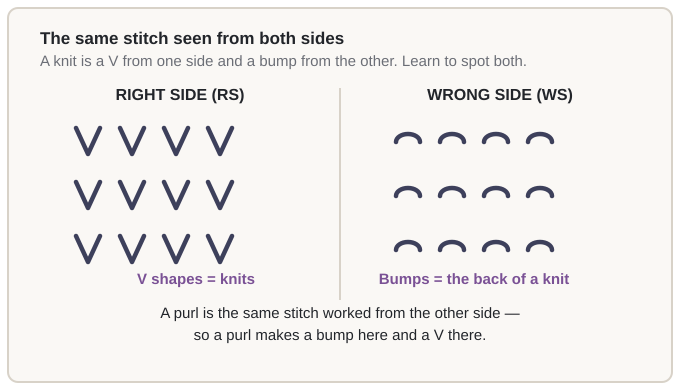
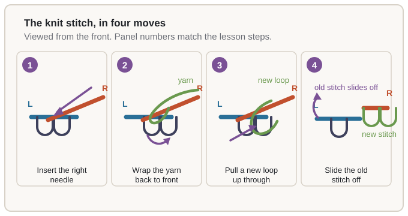

# 02.1 · The knit stitch

You are about to make the first loop of yarn that stays a loop. Everything afterwards in this
course — the purl, the cast-on, the hat, the sweater — is this one motion with variations on it, so
it is worth getting it right slowly rather than quickly. In this lesson you will cast on, knit ten
rows, and end up with a small rectangle of fabric that is the first thing you have ever made.

## What you need

- Your yarn and your 5 mm (US 8) needle.
- A pair of scissors, for nothing more than trimming the tail.
- The cast-on you learned in lesson 01.5: a slip knot tightened onto the needle, with about 20
  stitches on it.

> [!NOTE]
> If you have not cast on yet, you can still work this lesson. Make a slip knot, put it on the
> needle, and cast on 20 stitches in any way you can manage — even 20 separate slip knots, tightly
> closed, will do for practising this lesson. The long-tail method in 01.5 is much better, and you
> can unpick and redo your practice cast-on afterwards without losing anything.

## Why it works

A knit stitch is a new loop pulled through the loop below it. That is the whole trick, and it is
exactly the chain you saw in lesson 01.1: each loop hangs on the one beneath it, so a new loop at
the top extends the column by exactly one.

What the stitch *looks* like follows from one detail: when you pull the new loop up through the old
one, the old loop's two legs end up **inside** the new loop, one down each side. Two legs hanging
inside a loop, with the loop's head up on your needle, is exactly the shape of a `V` — which is why
a knit makes a V on the side facing you.

The other half of "why it works" is tension, and it is the half beginners get wrong. Each new
stitch must be **exactly as loose as the stitch beside it**, because the next row has to pass its
needle through it. Too tight and the next needle will not fit. Too loose and the fabric grows
ragged. This is why the first row of any piece is the hardest row: you are setting the width of
every row that follows, and you cannot see whether you are right until you have knitted a second
one.

> [!IMPORTANT]
> Consistent is more important than tight. Knitting evenly but loosely is a fabric you can fix.
> Knitting the first five rows too tight is a fabric that is too narrow forever, and no amount of
> care later will widen it.

## Step by step

The four moves below are the whole stitch. Learn them as four separate actions first, then as one
smooth motion, and only then try to knit without looking at your hands.

1. **Slide the next stitch to the tip of the left needle, and insert the right needle into the
   front of it.** The front of a stitch is the loop closest to you — the near half. You enter from
   the left, and you enter *into* the loop, not around it. If your right needle is sitting on top
   of the loop rather than through it, it is the wrong way round.

2. **Wrap the yarn from back to front around the right needle tip.** Your working yarn is on the
   right. Take it over the top of the right needle tip, down the front, and under. The yarn must
   end up at the **front** of the right needle, between the needle and you. If the yarn is behind
   the needle, the next move will not work and you will get a tangled mess rather than a stitch.

3. **Pull the new loop up through.** Keeping both needles roughly at the same angle, draw the
   right needle — and the yarn wrapped on it — back through the stitch you entered, towards you.
   Draw the new loop up until it is about as long as the stitches on the needle. Not longer: a long
   loose loop on the needle becomes a dropped stitch the moment it slides off.

4. **Let the old stitch slide off the left needle tip.** Do not pull it off, just let it go as the
   new loop tightens. The new stitch is now on the right needle. Slide it down to make room and
   repeat from step 1.

When the row is finished, turn the work, bring the yarn to the position you started from, and knit
the next row. The right side is always the side that faces you as you work.

This is slow, close-up and deliberately repetitive, and it shows the cast on, the knit stitch, the
purl stitch, the bind off and weaving in ends in one pass. Watch it more than once. The lesson is
complete without it, but the speed and the hand position are easier to copy than to read.

https://www.youtube.com/watch?v=SpfLTb56fMc

> [!TIP]
> Say the four moves out loud as you do them — "in, wrap, through, off". Experienced knitters have
> this running as an automatic rhythm, and building the rhythm now is what makes the rest of the
> course feel calm rather than effortful.

### Left-handed and Continental

Knitting uses both hands, and being left-handed does not limit any of this. Three options, and you
may change your mind at any time — the stitches you make are identical whichever you use.

**Left-handed English (throwing).** Do everything above exactly as written, but hold the working
yarn in your *left* hand and throw it over the left index finger to make slack, catching it with
the left hand before you wrap. Some left-handers find this no harder than the standard method.

**Continental (picking).** Wrap the working yarn around the fingers of your left hand so it is
lightly tensioned, then **pick it up with the right needle tip** instead of throwing it. The four
moves become: insert the right needle, pick the yarn up from the front with the tip and draw it
through to make the new loop, then let the old stitch off. There is no slack-making step and fewer
movements per stitch, which is why many knitters who find English tiring switch to it.

Continental is the option most left-handers find comfortable, because the yarn is already where
they want it. Many right-handers prefer it too. Try ten minutes of each and keep whichever is less
tiring — not whichever looks most traditional.

**Mirror knitting.** Some left-handers prefer to work from the right needle to the left, with the
stitches ending up on the left needle. The V still looks the same and the count still comes out the
same; only the direction of the work changes. The full translation table for every technique in
this course is on the [left-handed reference
page](../../references/left-handed.md).

> [!NOTE]
> Whichever method you use, the *fabric* is identical. This matters for patterns later: a hat made
> by a mirror knitter is the same hat, and a pattern written for standard working will fit it.

## Check your work

Look at your knitting. Four things to check, in this order:

- **Every stitch on the right side is a V.** Turn the work over: every stitch there should be a
  bump. If some stitches are bumps on the right side, you purled them by accident — and the only
  way to see that clearly is to look at the fabric rather than at the needles.
- **The fabric hangs straight down** when you hold the needle up. If it flares out into a fan, your
  edge stitches are looser than the middle ones. If it cups inward, the edges are tighter.
- **The first and last stitches of each row are the problem ones.** The first is usually tight,
  because you pull the yarn taut to get started. The last is usually loose, because you are
  speeding up to finish. Both are normal, and both are fixed by being deliberate at the turn.
- **Your cast-on edge is visible and even.** Spread the stitches along the needle until each sits
  at the same loose size as the next. A tight, narrow cast-on makes the whole piece narrow, and it
  is much easier to fix now than later.

If you are unsure whether a stitch is right, compare it with its neighbour. A row where every
stitch looks the same is correct, whatever the absolute size.

## Fixing common mistakes

**A stitch has slipped off the needle.** Symptom: the row of stitches looks one shorter than the
edge of the fabric, and there is a loose loop sitting on the old stitch. Cause: the new loop was
drawn out too long and slipped over the tip. Fix: put the loop back on the needle immediately,
tighten the neighbouring stitches to even it out, and carry on. This is the most common accident in
the first three rows and it is genuinely harmless.

**You knit through the back loop by accident.** Symptom: nothing. The stitch looks perfectly
normal — and one row later it looks wrong, because a stitch knitted through the back loop puts a
diagonal across its V and makes the fabric narrower. Cause: the right needle went into the half of
the loop furthest from you. Fix: knit the next row as normal, and in the row after that, knit the
offending stitch through its **front** loop. The [fixing mistakes
table](../../references/fixing-mistakes.md) has the short version.

**The first stitch of a row is a purl by accident.** Symptom: one bump at the start of a row where
a V should be. Cause: at the turn you wrapped the yarn without thinking, or you re-entered the
first stitch the way you do for a purl. Fix: on the next row, knit into that stitch as if to knit
it, then work the rest of the row normally. You cannot fix it on the row you have just worked, and
that is fine — it is a one-stitch repair.

**The needle will not go into a stitch.** Symptom: you are pushing hard and nothing is happening.
Cause: the stitch is tighter than the needle. Fix: do not force it. Push the stitches down the
left needle a little, which opens them up, and try again. If it is still tight, you have knitted
too tightly — take that as information for the next row, not as a failure.

## Practice

**The finish line: a rectangle about 10 cm (4") wide and 15 cm (6") tall, with a V on every
stitch on the right side.** It does not need to be square or pretty. It needs to be recognisably
knitted, and it needs to exist.

1. **Cast on 20 stitches.** Spread them evenly along the needle before you start.
2. **Knit 10 rows.** Count each row as you finish it, and note the count on the sheet below. The
   count must not change — if it does, you dropped or added a stitch, and now is the moment to
   notice.
3. **Bind off loosely** — knit two stitches, pass the first one over the second and off the needle,
   and repeat across the row. Do this gently; a tight bind-off makes a hard, unstretchy edge that
   you will unpick later.
4. **Label the swatch and fill in the card.** Write the yarn, the needle and the stitch pattern.
   Measure it flat, in the middle, without stretching it.

Printable version of these steps, with a row-count table to fill in:
[module 2 lab pack](../../labs/module-02/)

Then fill in the [swatch card](../../templates/swatch-card.md) and **keep the swatch**. This is the
first entry in your swatch book, and by Module 6 you will have a dozen of them, each one an
answer to a question you would otherwise have to re-knit to answer.

> [!TIP]
> Take a break every 25-30 minutes, even mid-row. Stop, put the work down, shake your hands out
> and look at something far away for twenty seconds. Most mistakes and most hand discomfort come
> from the last five minutes of a session, not the first forty.

## Tips from experienced knitters

- **Move the stitches down the left needle as you work.** This is the trick that lets you knit
  without looking: each stitch you finish gets pushed down towards the body, so the next stitch is
  always at the tip. Knitters who do this can knit a whole row without their eyes leaving the
  fabric.
- **Never "fix" a stitch by pulling it tight.** The cure for a loose stitch is the next stitch
  worked normally, not yanking the current one.
- **If the yarn is slippery, put the work down.** A worsted wool on a table or over a chair back is
  far easier to knit than the same yarn dangling in the air. This is a normal, accepted trick.
- **Keep the first row loose on purpose.** Many knitters cast on one size tighter than they would
  like for exactly this reason.
- **Learn the "tink" early.** Undoing one stitch at a time with the needles is the same motion as
  knitting, backwards, and it turns "I have made a mistake" from a crisis into a two-second fix.
  Module 5 covers it in full.

## Recap

- A knit stitch is a new loop pulled through the loop below, which extends the column by one.
- The old stitch's legs end up inside the new loop, which is what makes a `V` on the right side
  and a bump on the wrong side.
- Consistent tension matters more than tight tension, because the next row has to fit through
  every stitch.
- Four moves, in this order: **in, wrap, through, off.**
- Every row ends with the same count. That check costs two seconds and catches almost everything.

> The principle to keep: **knitting is adding one loop at a time, and every choice you make — which
> loop, how tight, where on the needle — is a decision about the next row.** That is why the course
> asks you to think about *why* at every step. It comes back in lesson 02.2, when we look at a
> stitch from the other side, and in Module 5, when you start reading and repairing your own
> knitting.
