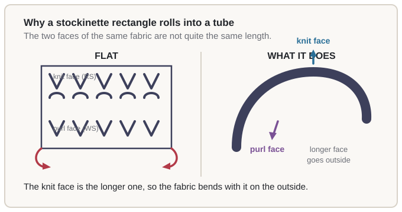
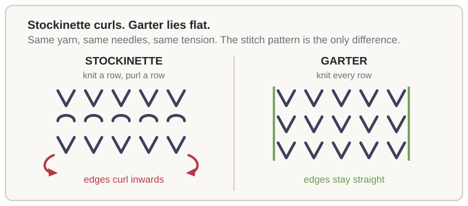

# 03.2 · Stockinette and why it curls

Stockinette is knit one row, purl the next — two stitches, two rows, the simplest possible fabric.
It is also the fabric that rolls itself into a tube, and almost every beginner is surprised by it
at least once. This lesson explains why it happens, and turns that explanation into a rule you can
use to choose stitch patterns for the rest of the course.

## What you need

- Your yarn and 5 mm (US 8) needle.
- The swatch from lesson 03.1, or a new cast-on of 20 stitches.
- About 30 cm (12") more yarn if you want to make the comparison pair.

## Why it works

From the last lesson you already know the fact this explanation is built on: **a row of purls is
narrower than a row of knits holding the same number of stitches.** Knit stitches spread out across
the row; purl stitches sit closer together.

Now put those two rows together, because a piece of stockinette is a knit row with a purl row
backing it. One face of the fabric is therefore made of wide, spread-out knits. The other face is
made of narrow, closely packed purls. **The two faces of the same fabric are not the same length.**

And a flat piece of fabric can only exist if its two faces *are* the same length. Think of a sheet
of paper with the bottom edge longer than the top: it cannot lie flat, because flat means the top
and bottom edges span the same distance. It has to curve, with the longer edge on the outside of
the curve — the outside of a curve is always the longer side.

So stockinette has no choice. The knit face is longer, the knit face has to go on the outside, and
the fabric bends accordingly. The result is a rectangle whose left and right edges curl inwards and
downwards, whose top and bottom edges curl too, and which, if you leave it alone long enough, ends
up as a tube with the knit side showing.

### The rule this gives you

> **Balance makes fabric lie flat.** A fabric whose two faces measure the same length stays flat.
> A fabric whose two faces differ must bend, and it will bend the same way every time.

That is the whole principle, and it is worth more than the specific case of stockinette, because
it lets you predict the behaviour of any stitch pattern you meet — including ones in patterns you
have not read yet.

The three patterns this course uses most are on the balanced side of that line:

| Pattern | How it is balanced | What you get |
|---|---|---|
| **Garter** — knit every row | Both faces look identical, so neither is longer than the other | Lies completely flat, very squishy, curls never |
| **Rib** — knit 1, purl 1, every row | Both faces show the same alternating columns; the knits and purls are distributed evenly | Flat, and it stretches and springs back |
| **Seed** — knit 1, purl 1, alternating each row | Every row contains equal numbers of knits and purls | Flat, bumpy, and very stretchy |

Stockinette and all-knit and all-purl are on the unbalanced side. All of them curl.

> [!NOTE]
> The curl is not a fault in your knitting. A perfectly knitted stockinette rectangle curls exactly
> as much as a badly knitted one. It is the fabric doing what its structure requires.

## Step by step

No new hand technique in this lesson. What follows is how to *see* the principle in your own
fabric, which is the part that makes it stick.

1. **Knit a stockinette swatch: 20 stitches, 10 rows, alternating a knit row and a purl row.** This
   is the fabric that curls.
2. **Knit a second swatch: 20 stitches, 10 rows, knitting every single row.** This is garter
   stitch. Use the same yarn, the same needles and the same tension.
3. **Lay both flat on a table, side by side, and do not touch them for a minute.** The stockinette
   will lift at its edges and hold a curve. The garter will lie dead flat. You are looking at the
   same yarn, the same needle and the same number of stitches, so the only variable is the stitch
   pattern.
4. **Measure each swatch in the middle, not at the edges, and record both on a
   [swatch card](../../templates/swatch-card.md).** Then turn each one over and measure again from
   the back. The stockinette measures slightly differently depending on which side is up and
   whether it is allowed to lie flat or is measured curled — that variation *is* the imbalance.
5. **Say the rule out loud and write it on the card:** *balanced fabric lies flat; unbalanced fabric
   curls.*

For a printable version of this comparison, and the one-page chart of all six fabrics in this
module:

[module 3 lab pack](../../labs/module-03/)

### Left-handed and Continental

There is no new hand motion in this lesson, and the curl is completely unaffected by how you hold
the yarn. Two things are worth knowing for later pattern reading:

- The diagram above is drawn from the right-hander's point of view. For a mirror knitter the two
  faces swap left and right, so the knit face is on the other side — but the knit face is still the
  longer one, and stockinette still curls. The conclusion is identical.
- Continental and English make the same fabric. A fabric knitted all the way Continental curls
  exactly as much as one knitted all the way English, so there is nothing to adjust.

If you do mirror knitting, see the [left-handed reference page](../../references/left-handed.md)
for the full translation table.

## Check your work

- **Which face is which on a curled piece?** Look for the `V`s. The face showing `V`s is the knit
  face, and on a curled stockinette piece it will be on the **outside** of the curve. This is the
  single most useful thing to be able to see, because it is how you identify the right side of a
  finished object with no label.
- **The flat test.** Put the swatch on a table and let go. Garter and rib stay where you put them.
  Stockinette lifts at the edges. Lift one corner of a stockinette swatch and it will fold towards
  you; lift a corner of garter and it stays.
- **How much curl is normal?** A lot. A stockinette rectangle in soft wool will roll into a tube
  within a few days of being finished. If your project is a scarf, that is a reason to change the
  stitch pattern. If your project is a hat, that is exactly what you want, and the curl is helping
  the hat hold its shape.
- **Curl is not a gauge problem.** A swatch that curls is still a correctly knitted swatch with a
  correct gauge. If you were to change your needle size to make the curl go away, you would be
  solving a problem that does not exist and creating a gauge that does not match the pattern.

## Fixing common mistakes

**Your first scarf rolled into a tube.** Symptom: a stockinette scarf that will not lie flat, and
will not stay wrapped. Cause: not a mistake at all — an unbalanced fabric doing what unbalanced
fabrics do. Fix: this is the moment to unpick. Choose garter, or a rib, or seed stitch for flat
fabric, and cast on again. Many knitters keep the rolled scarf anyway as an infinity scarf, which
is a perfectly good use for it.

**You tried to fix the curl by changing the needle size.** Symptom: the fabric still curls, and
now it is also the wrong size. Cause: a belief that curl comes from tension or gauge. Fix: go back
to the needle size the pattern asks for, and fix the curl with the stitch pattern instead. Gauge
decides *size*; the stitch pattern decides *behaviour*. Keeping those two separate is the habit
this lesson is for.

**You blocked the swatch and it still curls.** Symptom: the piece is slightly flatter but the edges
still lift. Cause: blocking relaxes the fibres and lets the piece take the shape you have pinned it
to — it does not rebalance the fabric, and it cannot. Fix: accept the partial improvement, which is
real and worth having, and choose a balanced pattern next time.

## Practice

**The finish line: two labelled swatches, side by side on a table, and a one-sentence rule in your
own words on both swatch cards.**

1. Make the stockinette and garter swatches from the steps above.
2. Fill in a [swatch card](../../templates/swatch-card.md) for each — including the width
   measurements, which will not be identical.
3. Sew them to a piece of card with the fabric names and your one-sentence rule, and keep the card.
4. If you can spare the yarn, cast on the number you would use for a 20 cm (8")-wide stockinette
   scarf, knit 20 rows, and then cast off and unknit the whole thing. Seeing that the curl is
   already there at 20 rows is the lesson.

> [!TIP]
> This is the most persuasive five minutes in the course. Almost every knitter has been told "knit
> a row, purl a row" without being told what will happen, and almost every knitter is then
> surprised. Doing the comparison yourself means you will not be surprised.

## Tips from experienced knitters

- **Use the curl.** A stockinette tube is a good hat body: the curl is what makes the hat hug your
  head instead of flapping. The fix for the curl belongs in the *brim*, which is usually rib, not
  in the body.
- **A "no-curl" bind-off only fixes one edge.** There are bind-offs that reduce curl at the top of
  a piece, and they are worth knowing — but they cannot stop the left and right edges curling,
  because that is the fabric's structure, not its edge.
- **Garter is the beginner's best friend.** It lies flat, it is squishy and warm, it hides
  uneven tension better than anything else, and it never curls. A first scarf in garter is almost
  impossible to get wrong.
- **Rib and seed are the workhorses.** Rib because it is flat *and* stretchy, which is exactly what
  a brim, a cuff and a waistband need. Seed because it is flat, stretchy, and the pattern is hard
  to lose your place in.
- **The next module lets you repair this by yourself.** In Module 5 you learn to read your own
  knitting closely enough to catch a mistake three rows down — which is the same skill as telling a
  knit from a purl by eye.

## Recap

- Stockinette is knit one row, purl the next. It is the most common fabric in knitting and the one
  that curls.
- The reason: knit stitches are wider than purl stitches, so **the knit face of stockinette is
  longer than the purl face.**
- A fabric whose two faces differ in length cannot lie flat. It bends with the longer face on the
  outside — so stockinette curls with the knit side showing.
- **Balance makes fabric lie flat.** Garter, rib and seed are balanced. Stockinette, all-knit and
  all-purl are not.
- Curl is not a gauge problem and not a tension problem. Do not change your needle size to fix it.
  Change the stitch pattern.

> The principle to keep: **the stitch pattern decides how the fabric behaves, and the balance
> between knits and purls decides whether it lies flat.** This is the first reusable rule in the
> course. It comes back in Module 4, where you choose a stitch pattern for your scarf, in
> Module 8, where a hat brim needs to be flat *and* stretchy, and in Module 13, where you are
> choosing stitch patterns yourself.
